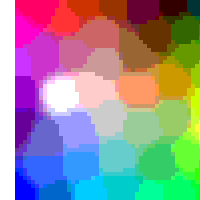
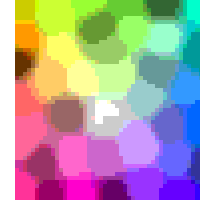
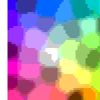
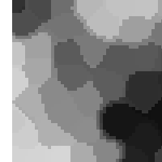
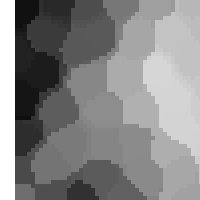
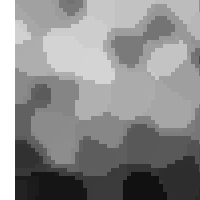
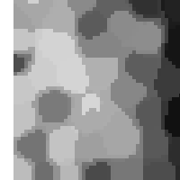
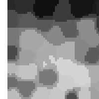

# Kohonen-Self-Organizing-Maps-CLISP
Kohonen SOMs is an unsupervised machine learning technique discovered by Professor Teuvo Kohonen in the 1980s. Kohonen SOMs are generally used for taking n-dimensional information and mapping it down to a 2D representation of the input space ℝn . In this project, this machine learning technique will be applied to a clustering a set of n-dimensional input and clustering the input together by common characteristics. Then categorizing the input to have a way to interact with the program. The application will be a form of color recognition utilizing kohonen Self Organizing Maps. The colors can be represented as vectors of (red, green, blue) components and the SOM will categorize the colors and you can then ask what color a given color vector best represents.

## Project Decomposition
Task Number | Task Title | COMPLETED
----------- | ---------- | ---------
1 | Symbolically Visualizing The Map | X
2 | Initializing The Weight Vector Map | X
3 | Finding The Winning Weight Vector | X
4 | Finding Neighboring Weight Vectors | X
5 | Creating The Learning Function | X
6 | Scaling The Neighboring Weight Vectors | X
7 | Visualizing The Grade Of The SOMs | X
8 | Color Recognition Through Classification | X
9 | Similarity Visualization | X
10 | SOMs Color Visualization | X
11 | Paint A Canvas From Colors In Two Different Clusters | X
12 | Write All Clusters To A File | X

## Samples From Project

.png)
.png)
.png)

.png)
.png)
.png)

.png)
.png)
.png)

## My Class Project Website
[Artificial Intelligence Class Project Website](http://cs.oswego.edu/~kzeller/Portfolio/coursework/csc466/AI.html)